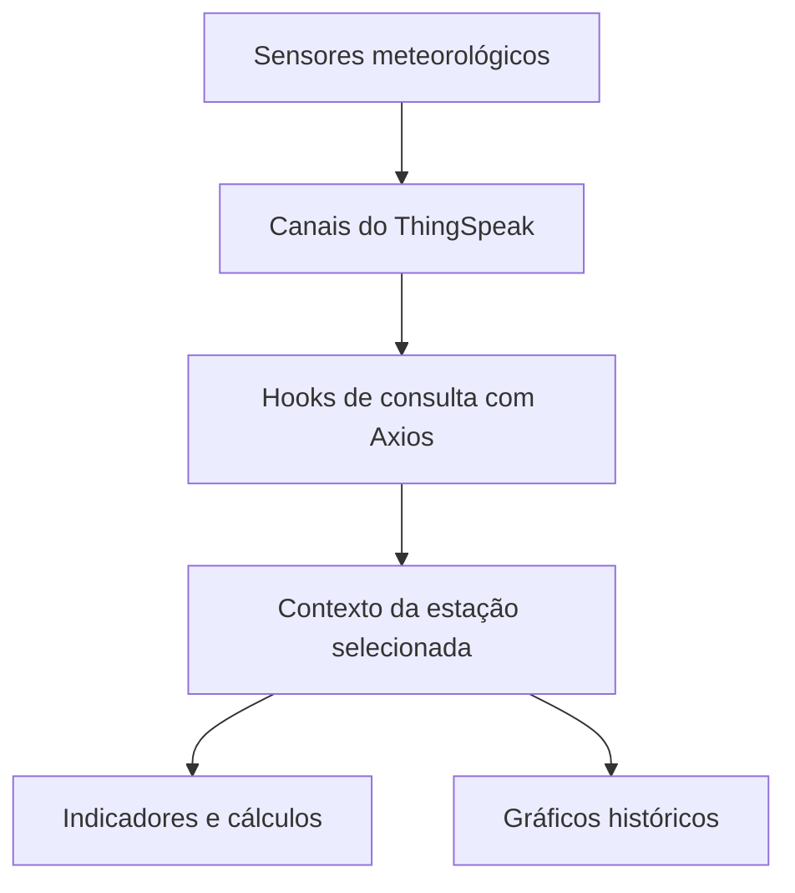

<div align="center">

# Dashboard Meteorológico UFRN

Aplicação web para monitoramento e visualização de dados climatológicos de estações localizadas no Seridó potiguar.


</div>

## Sobre o projeto

O **Dashboard Meteorológico UFRN** reúne dados obtidos por estações climatológicas e os apresenta em uma interface responsiva, com indicadores, gráficos históricos, informações de conforto ambiental e localização das estações.

O projeto foi desenvolvido durante meu estágio curricular obrigatório no **LABICAN — Laboratório de Inteligência Computacional Aplicada a Negócios**, vinculado à Universidade Federal do Rio Grande do Norte (UFRN).

Durante o trabalho, participei da análise de requisitos, do planejamento visual, do desenvolvimento da aplicação, dos testes e da implantação no servidor do laboratório.

## Funcionalidades

- Seleção entre diferentes estações de monitoramento;
- Consulta de dados por meio da API do ThingSpeak;
- Exibição da leitura mais recente de cada estação;
- Gráficos com o histórico das últimas 70 medições;
- Atualização automática dos dados atuais a cada 3 minutos;
- Visualização de temperatura, umidade, pressão atmosférica e luminosidade;
- Cálculo de conforto térmico, índice de calor, ponto de orvalho e altitude aproximada;
- Exibição da localização de cada estação em mapa integrado;
- Interface responsiva para computadores e dispositivos móveis;
- Alternância entre os temas claro e escuro.

## Estações disponíveis

| Estação | Localização |
| --- | --- |
| LABICAN | Caicó, Rio Grande do Norte |
| Estação Climatológica UFRN | Campus CERES/UFRN, Caicó |
| Estação de Carnaúba dos Dantas | Carnaúba dos Dantas, Rio Grande do Norte |

> A disponibilidade e a atualização das medições dependem do funcionamento dos sensores e dos respectivos canais no ThingSpeak.

## Tecnologias utilizadas

- **Next.js 14** — estrutura e renderização da aplicação;
- **React 18** — desenvolvimento da interface baseada em componentes;
- **TypeScript** — tipagem e maior segurança durante o desenvolvimento;
- **Axios** — comunicação com a API do ThingSpeak;
- **ApexCharts** — construção dos gráficos de monitoramento;
- **Context API** — compartilhamento da estação selecionada entre componentes;
- **Font Awesome** — ícones utilizados na interface;
- **CSS3** — estilização, responsividade e temas claro/escuro;
- **Google Maps Embed** — localização das estações.

## Fluxo dos dados



## Estrutura do projeto

```text
dashboard-next/
├── README.md
└── project/
    ├── public/
    ├── src/
    │   ├── app/          # Páginas, layout e estilos globais
    │   ├── components/   # Componentes da interface
    │   ├── contexts/     # Contexto da estação selecionada
    │   └── hooks/        # Integração com a API do ThingSpeak
    ├── package.json
    └── tsconfig.json
```

## Como executar localmente

### Pré-requisitos

- [Node.js](https://nodejs.org/) 18 ou superior;
- npm;
- Git.

### Instalação

```bash
# Clone o repositório
git clone https://github.com/Gabrielygor/dashboard-next.git

# Acesse a pasta da aplicação
cd dashboard-next/project

# Instale as dependências
npm install

# Inicie o servidor de desenvolvimento
npm run dev
```

Abra [http://localhost:3000](http://localhost:3000) no navegador.

## Scripts disponíveis

| Comando | Descrição |
| --- | --- |
| `npm run dev` | Inicia o ambiente de desenvolvimento |
| `npm run build` | Gera a versão de produção |
| `npm run start` | Executa a versão de produção |
| `npm run lint` | Verifica a qualidade do código com ESLint |

## Fonte dos dados

As medições são consultadas nos canais públicos das estações por meio da [API do ThingSpeak](https://thingspeak.mathworks.com/). A aplicação utiliza a leitura mais recente nos indicadores e as últimas 70 entradas nos gráficos.

## Contexto acadêmico

- **Instituição:** Universidade Federal do Rio Grande do Norte — UFRN;
- **Laboratório:** LABICAN — Laboratório de Inteligência Computacional Aplicada a Negócios;

## Autor

Desenvolvido por **Gabriel Ygor Canuto**.

[](https://www.linkedin.com/in/gabriel-canuto-008030292/)
[](https://github.com/Gabrielygor)
